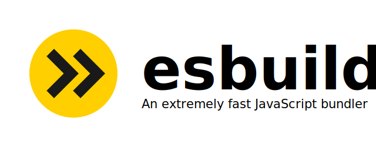
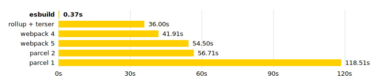

  
   
  <a href="https://esbuild.github.io/">Website</a> |
  <a href="https://esbuild.github.io/getting-started/">Getting started</a> |
  <a href="https://esbuild.github.io/api/">Documentation</a> |
  <a href="https://esbuild.github.io/plugins/">Plugins</a> |
  <a href="https://esbuild.github.io/faq/">FAQ</a>

## Why?

Our current build tools for the web are 10-100x slower than they could be:

  

The main goal of the esbuild bundler project is to bring about a new era of build tool performance, and create an easy-to-use modern bundler along the way.

Major features:

* Extreme speed without needing a cache
* ES6 and CommonJS modules
* Tree shaking of ES6 modules
* An [API](https://esbuild.github.io/api/) for JavaScript and Go
* [TypeScript](https://esbuild.github.io/content-types/#typescript) and [JSX](https://esbuild.github.io/content-types/#jsx) syntax
* [Source maps](https://esbuild.github.io/api/#sourcemap)
* [Minification](https://esbuild.github.io/api/#minify)
* [Plugins](https://esbuild.github.io/plugins/)

Check out the [getting started](https://esbuild.github.io/getting-started/) instructions if you want to give esbuild a try.
