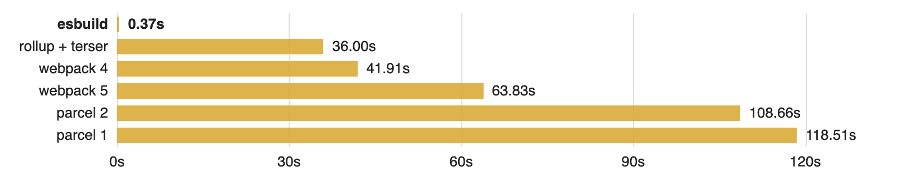

# esbuild

[](https://godoc.org/github.com/evanw/esbuild/pkg/api)

This is a JavaScript bundler and minifier. It packages up JavaScript and TypeScript code for distribution on the web.

## Documentation

* [JavaScript API documentation](docs/js-api.md)
* [Go API documentation](https://godoc.org/github.com/evanw/esbuild/pkg/api)
* [Architecture documentation](docs/architecture.md)
* [中文文档](http://docs.breword.com/evanw-esbuild/)

## Why?

Why build another JavaScript build tool? The current build tools for the web are at least an order of magnitude slower than they should be. I'm hoping that this project serves as an "existence proof" that our JavaScript tooling can be much, much faster.

## Benchmarks

The use case I have in mind is packaging a large codebase for production. This includes minifying the code, which reduces network transfer time, and producing source maps, which are important for debugging errors in production. Ideally the build tool should also build quickly without having to warm up a cache first.

I currently have two benchmarks that I'm using to measure esbuild performance. For these benchmarks, esbuild is at least **100x faster** than the other JavaScript bundlers I tested:



Here are the details about each benchmark:

* #### JavaScript benchmark

  This benchmark approximates a large JavaScript codebase by duplicating the [three.js](https://github.com/mrdoob/three.js) library 10 times and building a single bundle from scratch, without any caches. The benchmark can be run with `make bench-three`.

    | Bundler            |    Time | Relative slowdown | Absolute speed | Output size |
    | :----------------- | ------: | ----------------: | -------------: | ----------: |
    | esbuild            |   0.36s |                1x |  1520.7 kloc/s |      5.82mb |
    | esbuild (1 thread) |   1.25s |                4x |   438.0 kloc/s |      5.82mb |
    | rollup + terser    |  36.06s |              100x |    15.2 kloc/s |      5.80mb |
    | webpack            |  44.74s |              124x |    12.2 kloc/s |      5.97mb |
    | fuse-box@next      |  59.52s |              165x |     9.2 kloc/s |      6.34mb |
    | parcel             | 121.18s |              337x |     4.5 kloc/s |      5.89mb |

    Each time reported is the best of three runs. I'm running esbuild with `--bundle --minify --sourcemap` (the single-threaded version uses `GOMAXPROCS=1`). I used the `rollup-plugin-terser` plugin because Rollup itself doesn't support minification. Webpack uses `--mode=production --devtool=sourcemap`. Parcel uses the default options. FuseBox is configured with `useSingleBundle: true`. Absolute speed is based on the total line count including comments and blank lines, which is currently 547,441. The tests were done on a 6-core 2019 MacBook Pro with 16gb of RAM.

    Caveats:

    * Parcel: The bundle crashes at run time with `TypeError: Cannot redefine property: dynamic`
    * FuseBox: The line numbers in source maps appear to be off by one

* #### TypeScript benchmark

  This benchmark uses the [Rome](https://github.com/facebookexperimental/rome) build tool to approximate a large TypeScript codebase. All code must be combined into a single minified bundle with source maps and the resulting bundle must work correctly. The benchmark can be run with `make bench-rome`.

    | Bundler            |    Time | Relative slowdown | Absolute speed | Output size |
    | :----------------- | ------: | ----------------: | -------------: | ----------: |
    | esbuild            |   0.10s |                1x |  1287.5 kloc/s |      0.98mb |
    | esbuild (1 thread) |   0.32s |                3x |   412.0 kloc/s |      0.98mb |
    | parcel             |  16.77s |              168x |     7.9 kloc/s |      1.55mb |
    | webpack            |  18.67s |              187x |     7.1 kloc/s |      1.26mb |

    Each time reported is the best of three runs. I'm running esbuild with `--bundle --minify --sourcemap --platform=node` (the single-threaded version uses `GOMAXPROCS=1`). Webpack uses `ts-loader` with `transpileOnly: true` and `--mode=production --devtool=sourcemap`. Parcel uses `--target node --bundle-node-modules`. Absolute speed is based on the total line count including comments and blank lines, which is currently 131,836. The tests were done on a 6-core 2019 MacBook Pro with 16gb of RAM.

    The results don't include Rollup because I couldn't get it to work. I tried `rollup-plugin-typescript`, `@rollup/plugin-typescript`, and `@rollup/plugin-sucrase` and they all didn't work for different reasons relating to TypeScript compilation. And I'm not familiar with FuseBox so I'm not sure how work around build failures due to the use of builtin node modules.

## Why is it fast?

Several reasons:

* It's written in Go, a language that compiles to native code
* Parsing, printing, and source map generation are all fully parallelized
* Everything is done in very few passes without expensive data transformations
* Code is written with speed in mind, and tries to avoid unnecessary allocations

## Status

#### Currently supported:

* JavaScript and TypeScript syntax
* CommonJS and ES6 modules
* JSX-to-JavaScript conversion
* Bundling using `--bundle` with scope hoisting ES6 modules
* Full minification with `--minify` (whitespace, identifiers, and mangling)
* Full source map support when `--sourcemap` is enabled
* Compile-time identifier substitutions via `--define`
* Tree shaking of ES6 modules supporting `sideEffects` in `package.json`
* Path substitution using the `browser` field in `package.json`
* Automatic detection of `baseUrl` and `paths` in `tsconfig.json`

#### JavaScript syntax support:

Syntax transforms convert newer JavaScript syntax to older JavaScript syntax for use with older browsers. You can set the language target with the `--target` flag, which goes back as far as ES6. Note that if you use a syntax feature that esbuild doesn't yet have support for transforming to your current language target, esbuild will still build successfully but will generate a warning where the unsupported syntax is used and will pass the syntax through un-transformed.

These syntax features are always transformed for older browsers:

| Syntax transform                                                                                                   | Language version | Example       |
|--------------------------------------------------------------------------------------------------------------------|------------------|---------------|
| [Trailing commas in function parameter lists and calls](https://github.com/tc39/proposal-trailing-function-commas) | `es2017`         | `foo(a, b, )` |
| [Numeric separators](https://github.com/tc39/proposal-numeric-separator)                                           | `esnext`         | `1_000_000`   |

These syntax features are conditionally transformed for older browsers depending on the configured language target:

| Syntax transform                                                                    | Transformed when `--target` is below | Example                    |
|-------------------------------------------------------------------------------------|--------------------------------------|----------------------------|
| [Exponentiation operator](https://github.com/tc39/proposal-exponentiation-operator) | `es2016`                             | `a ** b`                   |
| [Async functions](https://github.com/tc39/ecmascript-asyncawait)                    | `es2017`                             | `async () => {}`            |
| [Spread properties](https://github.com/tc39/proposal-object-rest-spread)            | `es2018`                             | `let x = {...y}`           |
| [Optional catch binding](https://github.com/tc39/proposal-optional-catch-binding)   | `es2019`                             | `try {} catch {}`          |
| [Optional chaining](https://github.com/tc39/proposal-optional-chaining)             | `es2020`                             | `a?.b`                     |
| [Nullish coalescing](https://github.com/tc39/proposal-nullish-coalescing)           | `es2020`                             | `a ?? b`                   |
| [Class instance fields](https://github.com/tc39/proposal-class-fields)              | `esnext`                             | `class { x }`              |
| [Static class fields](https://github.com/tc39/proposal-static-class-features)       | `esnext`                             | `class { static x }`       |
| [Private instance methods](https://github.com/tc39/proposal-private-methods)        | `esnext`                             | `class { #x() {} }`        |
| [Private instance fields](https://github.com/tc39/proposal-class-fields)            | `esnext`                             | `class { #x }`             |
| [Private static methods](https://github.com/tc39/proposal-static-class-features)    | `esnext`                             | `class { static #x() {} }` |
| [Private static fields](https://github.com/tc39/proposal-static-class-features)     | `esnext`                             | `class { static #x }`      |
| [Logical assignment operators](https://github.com/tc39/proposal-logical-assignment) | `esnext`                             | `a ??= b`                  |

<details>
<summary>Syntax transform caveats (click to expand)</summary><br>

* **Nullish coalescing correctness**

    By default `a ?? b` is transformed into `a != null ? a : b`, which works because `a != null` is only false if `a` is `null` or `undefined`. However, there's exactly one obscure edge case where this doesn't work. For legacy reasons, the value of `document.all` is special-cased such that `document.all != null` is false. If you need to use this value with the nullish coalescing operator, you should enable `--strict` transforms so `a ?? b` becomes `a !== null && a !== void 0 ? a : b` instead, which works correctly with `document.all`. The strict transform isn't done by default because it causes code bloat for an obscure edge case that shouldn't matter in modern code.

* **Private member performance**

    This transform uses `WeakMap` and `WeakSet` to preserve the privacy properties of this feature, similar to the corresponding transforms in the Babel and TypeScript compilers. Most modern JavaScript engines (V8, JavaScriptCore, and SpiderMonkey but not ChakraCore) may not have good performance characteristics for large `WeakMap` and `WeakSet` objects. Creating many instances of classes with private fields or private methods with this syntax transform active may cause a lot of overhead for the garbage collector. This is because modern engines (other than ChakraCore) store weak values in an actual map object instead of as hidden properties on the keys themselves, and large map objects can cause performance issues with garbage collection. See [this reference](https://github.com/tc39/ecma262/issues/1657#issuecomment-518916579) for more information.
</details>

These syntax features are currently always passed through un-transformed:

| Syntax transform                                                                    | Unsupported when `--target` is below | Example                     |
|-------------------------------------------------------------------------------------|--------------------------------------|-----------------------------|
| [Rest properties](https://github.com/tc39/proposal-object-rest-spread)              | `es2018`                             | `let {...x} = y`            |
| [Asynchronous iteration](https://github.com/tc39/proposal-async-iteration)          | `es2018`                             | `for await (let x of y) {}` |
| [Async generators](https://github.com/tc39/proposal-async-iteration)                | `es2018`                             | `async function* foo() {}`  |
| [BigInt](https://github.com/tc39/proposal-bigint)                                   | `es2020`                             | `123n`                      |
| [Hashbang grammar](https://github.com/tc39/proposal-hashbang)                       | `esnext`                             | `#!/usr/bin/env node`       |

These syntax features are not yet supported, and currently cannot be parsed:

| Syntax transform                                                    | Language version | Example           |
|---------------------------------------------------------------------|------------------|-------------------|
| [Top-level await](https://github.com/tc39/proposal-top-level-await) | `esnext`         | `await import(x)` |

See also [the list of finished ECMAScript proposals](https://github.com/tc39/proposals/blob/master/finished-proposals.md) and [the list of active ECMAScript proposals](https://github.com/tc39/proposals/blob/master/README.md).

#### TypeScript syntax support:

TypeScript files are transformed by removing type annotations and converting TypeScript-only syntax features to JavaScript code. This section documents the support of TypeScript-only syntax features. Please refer to the [previous section](#javascript-syntax-support) for support of JavaScript syntax features, which also applies in TypeScript files.

*Note that esbuild does not do any type checking. You will still want to run type checking using something like `tsc -noEmit`.*

These TypeScript-only syntax features are supported, and are always converted to JavaScript (a non-exhaustive list):

| Syntax feature          | Example                    | Notes |
|-------------------------|----------------------------|-------|
| Namespaces              | `namespace Foo {}`         | |
| Enums                   | `enum Foo { A, B }`        | |
| Const enums             | `const enum Foo { A, B }`  | Behaves the same as regular enums |
| Generic type parameters | `<T>(a: T): T => a`        | |
| JSX with types          | `<Element<T>/>`            | |
| Type casts              | `a as B` and `<B>a`        | |
| Type imports            | `import {Type} from 'foo'` | Handled by removing all unused imports |
| Type exports            | `export {Type} from 'foo'` | Handled by ignoring missing exports in TypeScript files |
| Experimental decorators | `@sealed class Foo {}`     | The `emitDecoratorMetadata` flag is not supported |

These TypeScript-only syntax features are parsed and ignored (a non-exhaustive list):

| Syntax feature         | Example                         |
|------------------------|---------------------------------|
| Interface declarations | `interface Foo {}`              |
| Type declarations      | `type Foo = number`             |
| Function declarations  | `function foo(): void;`         |
| Ambient declarations   | `declare module 'foo' {}`       |
| Type-only imports      | `import type {Type} from 'foo'` |
| Type-only exports      | `export type {Type} from 'foo'` |

#### Disclaimers:

* As far as I know, this hasn't yet been used in production by anyone yet. It's still pretty new code and you may run into some bugs.

    That said, a lot of effort has gone into handling all of the various edge cases in the JavaScript and TypeScript language specifications and esbuild works well on many real-world code bases. For example, esbuild can bundle [rollup](https://github.com/rollup/rollup), [sucrase](https://github.com/alangpierce/sucrase), and [esprima](https://github.com/jquery/esprima) (all TypeScript code bases) and the generated bundles pass all tests. If you find an issue with language support (especially with real-world code), please report it so it can get fixed.

* This project is still pretty early and I'd like to keep the scope relatively focused, at least for now. I'm trying to create a build tool that a) works well for a given sweet spot of use cases and b) resets the expectations of the community for what it means for a JavaScript build tool to be fast. I'm not trying to create an extremely flexible build system that can build anything.

    That said, esbuild now has a [JavaScript API](docs/js-api.md) and a [Go API](https://godoc.org/github.com/evanw/esbuild/pkg/api). This can be used as a library to minify JavaScript, convert TypeScript/JSX to JavaScript, or convert newer JavaScript to older JavaScript. So even if esbuild doesn't support a particular technology, it's possible that esbuild can still be integrated as a library to help speed it up. For example, [Vite](https://github.com/vuejs/vite) recently started using esbuild's transform library to add support for TypeScript (the official TypeScript compiler was too slow).

* I'm mainly looking for feedback at the moment, not contributions. The project is early and I'm still working toward an MVP bundler that can reasonably replace real-world toolchains. There are still major fundamental pieces that haven't been put in place yet (e.g. CSS support, watch mode, code splitting) and they all need to work well together to have best-in-class performance.

## Install

A prebuilt binary can be installed using npm:

* **Local install (recommended)**

    This installs the `esbuild` command locally in your project's `package.json` file:

    ```
    npm install --save-dev esbuild
    ```

    Invoke it using `npx esbuild [arguments]`. Note that this uses the `npx` package runner command, not the `npm` package manager command.

    This is the recommended project-based workflow because it allows you to have a different version of `esbuild` for each project and it ensures that everyone working on a given project has the same version of `esbuild`.

* **Global install**

    This adds a global command called `esbuild` to your path:

    ```
    npm install --global esbuild
    ```

    Invoke it using `esbuild [arguments]`.

    A global install can be handy if you want to run `esbuild` outside of a project context for one-off file manipulation tasks.

The `esbuild` package should work on 64-bit macOS, Linux, and Windows systems. It contains an install script that downloads the appropriate package for the current platform. If the install script isn't working or you need to run esbuild on an unsupported platform, there is a fallback WebAssembly package called [esbuild-wasm](https://npmjs.com/package/esbuild-wasm) that should work on all platforms.

<details>
<summary>Other installation methods (click to expand)</summary><br>

The binary is only hosted on npm for convenience. Since esbuild is a native binary, it's not necessary to install npm to use esbuild.

### Download using HTTP

The binary can be downloaded from the npm registry directly over HTTP without needing to install npm first.

* For Linux (the binary will be `./package/bin/esbuild`):

    ```
    curl -O https://registry.npmjs.org/esbuild-linux-64/-/esbuild-linux-64-0.0.0.tgz
    tar xf ./esbuild-linux-64-0.0.0.tgz
    ```

* For macOS (the binary will be `./package/bin/esbuild`):

    ```
    curl -O https://registry.npmjs.org/esbuild-darwin-64/-/esbuild-darwin-64-0.0.0.tgz
    tar xf ./esbuild-darwin-64-0.0.0.tgz
    ```

* For Windows (the binary will be `./package/esbuild.exe`):

    ```
    curl -O https://registry.npmjs.org/esbuild-windows-64/-/esbuild-windows-64-0.0.0.tgz
    tar xf ./esbuild-windows-64-0.0.0.tgz
    ```

Substitute `0.0.0` for the version of esbuild that you want to download.

### Install using Go

If you have the Go compiler toolchain installed, you can use it to install the `esbuild` command globally:

```
GO111MODULE=on go get https://github.com/evanw/esbuild@v0.0.0
```

The binary will be placed in Go's global binary directory (the directory called `bin` located inside the directory returned by `go env GOPATH`). You may need to add that `bin` directory to your `PATH`. Substitute `v0.0.0` for the version of esbuild that you want to build.

### Build from source

You can also build esbuild from source:

```
git clone --depth 1 --branch v0.0.0 https://github.com/evanw/esbuild.git
cd esbuild
go build ./cmd/esbuild
```

This will create a binary called `esbuild` (`esbuild.exe` on Windows) in the current directory. Substitute `v0.0.0` for the version of esbuild that you want to build.
</details>

## Command-line usage

The command-line interface takes a list of entry points and produces one bundle file per entry point. Here are the available options:

```
Usage:
  esbuild [options] [entry points]

Options:
  --bundle              Bundle all dependencies into the output files
  --outfile=...         The output file (for one entry point)
  --outdir=...          The output directory (for multiple entry points)
  --sourcemap           Emit a source map
  --target=...          Language target (default esnext)
  --platform=...        Platform target (browser or node, default browser)
  --external:M          Exclude module M from the bundle
  --format=...          Output format (iife, cjs, esm)
  --color=...           Force use of color terminal escapes (true or false)
  --global-name=...     The name of the global for the IIFE format

  --minify              Sets all --minify-* flags
  --minify-whitespace   Remove whitespace
  --minify-identifiers  Shorten identifiers
  --minify-syntax       Use equivalent but shorter syntax

  --define:K=V          Substitute K with V while parsing
  --jsx-factory=...     What to use instead of React.createElement
  --jsx-fragment=...    What to use instead of React.Fragment
  --loader:X=L          Use loader L to load file extension X, where L is
                        one of: js, jsx, ts, tsx, json, text, base64, file, dataurl

Advanced options:
  --version                 Print the current version and exit
  --sourcemap=inline        Emit the source map with an inline data URL
  --sourcemap=external      Do not link to the source map with a comment
  --sourcefile=...          Set the source file for the source map (for stdin)
  --error-limit=...         Maximum error count or 0 to disable (default 10)
  --log-level=...           Disable logging (info, warning, error, silent)
  --resolve-extensions=...  A comma-separated list of implicit extensions
  --metafile=...            Write metadata about the build to a JSON file
  --strict                  Transforms handle edge cases but have more overhead

  --trace=...           Write a CPU trace to this file
  --cpuprofile=...      Write a CPU profile to this file

Examples:
  # Produces dist/entry_point.js and dist/entry_point.js.map
  esbuild --bundle entry_point.js --outdir=dist --minify --sourcemap

  # Allow JSX syntax in .js files
  esbuild --bundle entry_point.js --outfile=out.js --loader:.js=jsx

  # Substitute the identifier RELEASE for the literal true
  esbuild example.js --outfile=out.js --define:RELEASE=true

  # Provide input via stdin, get output via stdout
  esbuild --minify --loader=ts < input.ts > output.js
```

## Using with React

To use esbuild with [React](https://reactjs.org/):

* Either put all JSX syntax in `.jsx` files instead of `.js` files, or use `--loader:.js=jsx` to use the JSX loader for `.js` files.

* If you're using TypeScript, pass esbuild your `.tsx` file as the entry point. There should be no need to convert TypeScript files to JavaScript first because esbuild parses TypeScript syntax itself.

    *Note that esbuild does not do any type checking, so you'll want to run `tsc -noEmit` in parallel to check types.*

* If you're using esbuild to bundle React yourself instead of including it with a `<script>` tag in your HTML, you'll need to pass `'--define:process.env.NODE_ENV="development"'` or `'--define:process.env.NODE_ENV="production"'` to esbuild on the command line.

    *Note that the double quotes around `"production"` are important because the replacement should be a string, not an identifier. The outer single quotes are for escaping the double quotes in Bash but may not be necessary in other shells.*

* If you're using [Preact](https://preactjs.com/) instead of React, you'll also need to pass `--jsx-factory=preact.h --jsx-fragment=preact.Fragment` to esbuild on the command line.

For example, if you have a file called `example.tsx` with the following contents:

```js
import * as React from 'react'
import * as ReactDOM from 'react-dom'

ReactDOM.render(
  <h1>Hello, world!</h1>,
  document.getElementById('root')
);
```

Use this for a development build:

```
esbuild example.tsx --bundle '--define:process.env.NODE_ENV="development"' --outfile=out.js
```

Use this for a production build:

```
esbuild example.tsx --bundle '--define:process.env.NODE_ENV="production"' --minify --outfile=out.js
```
