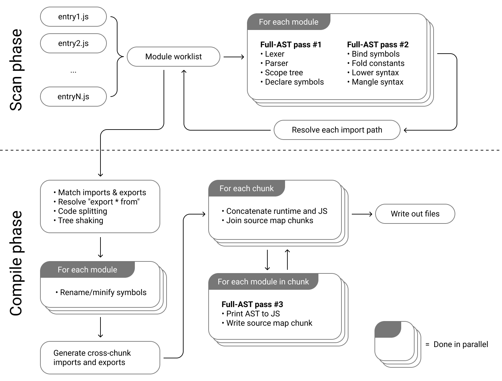

* [Architecture](#architecture)
    * [Design principles](#design-principles)
* [Overview](#overview)
    * [Scan phase](#scan-phase)
    * [Compile phase](#compile-phase)
* [Notes about parsing](#notes-about-parsing)
    * [Symbols and scopes](#symbols-and-scopes)
    * [Constant folding](#constant-folding)
    * [TypeScript parsing](#typescript-parsing)
* [Notes about linking](#notes-about-linking)
    * [CommonJS linking](#commonjs-linking)
    * [ES6 linking](#es6-linking)
    * [Hybrid CommonJS and ES6 modules](#hybrid-commonjs-and-es6-modules)
    * [Scope hoisting](#scope-hoisting)
    * [Converting ES6 imports to CommonJS imports](#converting-es6-imports-to-commonjs-imports)
    * [The runtime library](#the-runtime-library)
* [Notes about printing](#notes-about-printing)

# Architecture

This document covers how esbuild's bundler works. It's intended to aid in understanding the code, in understanding what tricks esbuild uses to improve performance, and hopefully to enable people to modify the code.

Note that there are some design decisions that have been made differently than other bundlers for performance reasons. These decisions may make the code harder to work with. Keep in mind that this project is an experiment in progress, and is not the result of a comprehensive survey of implementation techniques. The way things work now is not necessarily the best way of doing things.

### Design principles

* **Maximize parallelism**

    Most of the time should be spent doing fully parallelizable work. This can be observed by taking a CPU trace using the `--trace=[file]` flag and viewing it using `go tool trace [file]`.

* **Avoid doing unnecessary work**

    For example, many bundlers have intermediate stages where they write out JavaScript code and read it back in using another tool. This is work is unnecessary because if the tools used the same data structures, no conversion would be needed.

* **Transparently support both ES6 and CommonJS module syntax**

    The parser in esbuild processes a superset of both ES6 and CommonJS modules. It doesn't distinguish between ES6 modules and other modules so you can use both ES6 and CommonJS syntax in the same file if you'd like.

* **Try to do as few full-AST passes as possible for better cache locality**

    Compilers usually have many more passes because separate passes makes code easier to understand and maintain. There are currently only three full-AST passes in esbuild because individual passes have been merged together as much as possible:

    1. Lexing + parsing + scope setup + symbol declaration
    2. Symbol binding + constant folding + syntax lowering + syntax mangling
    3. Printing + source map generation

* **Structure things to permit a "watch mode" where compilation can happen incrementally**

    Incremental builds mean only rebuilding changed files to the greatest extent possible. This means not re-running any of the full-AST passes on unchanged files. Data structures that live across builds must be immutable to allow sharing. Unfortunately the Go type system can't enforce this, so care must be taken to uphold this as the code evolves.

* **Each file is processed once despite being used by multiple entry points**

    Some projects have many entry points that share a lot of code. Builds go faster when the effort for each shared module is done once and reused across entry points. To accomplish this, esbuild moves ES6 imports and exports outside the AST so they are external to the full-AST passes, which can then be shared.

## Overview



The build pipeline has two main phases: scan and compile. These both reside in the `bundler` package and are invoked from the `main` package.

### Scan phase

This phase starts with a set of entry points and traverses the dependency graph to find all modules that need to be in the bundle. This is implemented in `bundler.ScanBundle()` as a parallel worklist algorithm. The worklist starts off being the list of entry points. Each file in the list is parsed into an AST on a separate goroutine and may add more files to the worklist if it has any dependencies (either ES6 `import` statements, ES6 `import()` expressions, or CommonJS `require()` expressions). Scanning continues until the worklist is empty.

### Compile phase

This phase creates a bundle for each entry point, which involves first "linking" imports with exports, then converting the parsed ASTs back into JavaScript, then concatenating them together to form the final bundled file. This happens in `(*Bundle).Compile()`.

## Notes about parsing

The parser is separate from the lexer. The lexer is called on the fly as the file is parsed instead of lexing the entire input ahead of time. This is necessary due to certain syntactical features such as regular expressions vs. the division operator and JSX elements vs. the less-than operator, where which token is parsed depends on the semantic context.

Lexer lookahead has been kept to one token in almost all cases with the notable exception of TypeScript, which requires arbitrary lookahead to parse correctly. All such cases are in methods called `trySkipTypeScript*WithBacktracking()` in the parser.

The parser includes a lot of transformations, all of which have been condensed into just two passes for performance:

1. The first pass does lexing and parsing, sets up the scope tree, and declares all symbols in their respective scopes.

2. The second pass binds all identifiers to their respective symbols using the scope tree, substitutes compile-time definitions for their values, performs constant folding, does lowering of syntax if we're targeting an older version of JavaScript, and performs syntax mangling/compression if we're doing a production build.

Note that, from experience, the overhead of syscalls in import path resolution is appears to be very high. Caching syscall results in the resolver and the file system implementation is a very sizable speedup.

### Symbols and scopes

A symbol is a way to refer to an identifier in a precise way. Symbols are referenced using a 64-bit identifier instead of using the name, which makes them easy to refer to without worrying about scope. For example, the parser can generate new symbols without worrying about name collisions. All identifiers reference a symbol, even "unbound" ones that don't have a matching declaration. Symbols have to be declared in a separate pass from the pass that binds identifiers to symbols because JavaScript has "variable hoisting" where a child scope can declare a hoisted symbol that can become bound to identifiers in parent and sibling scopes.

Symbols for the whole file are stored in a flat top-level array. That way you can easily traverse over all symbols in the file without traversing the AST. That also lets us easily create a modified AST where the symbols have been changed without affecting the original immutable AST. Because symbols are identified by their index into the top-level symbol array, we can just clone the array to clone the symbols and we don't need to worry about rewiring all of the symbol references.

The scope tree is not attached to the AST because it's really only needed to pass information from the first pass to the second pass. The scope tree is instead temporarily mapped onto the AST within the parser. This is done by having the first and second passes both call `pushScope*()` and `popScope()` the same number of times in the same order. Specifically the first pass calls `pushScopeForParsePass()` which appends the pushed scope to `scopesInOrder`, and the second pass calls `pushScopeForVisitPass()` which reads off the scope to push from `scopesInOrder`.

This is mostly pretty straightforward except for a few places where the parser has pushed a scope and is in the middle of parsing a declaration only to discover that it's not a declaration after all. This happens in TypeScript when a function is forward-declared without a body, and in JavaScript when it's ambiguous whether a parenthesized expression is an arrow function or not until we reach the `=>` token afterwards. This would be solved by doing three passes instead of two so we finish parsing before starting to set up scopes and declare symbols, but we're trying to do this in just two passes. So instead we call `popAndDiscardScope()` or `popAndFlattenScope()` instead of `popScope()` to modify the scope tree later if our assumptions turn out to be incorrect.

### Constant folding

The constant folding and compile-time definition substitution is pretty minimal but is enough to handle libraries such as React which contain code like this:

```js
if (process.env.NODE_ENV === 'production') {
  module.exports = require('./cjs/react.production.min.js');
} else {
  module.exports = require('./cjs/react.development.js');
}
```

Using `--define:process.env.NODE_ENV="production"` on the command line will cause `process.env.NODE_ENV === 'production'` to become `"production" === 'production'` which will then become `true`. The parser then treats the `else` branch as dead code, which means it ignores calls to `require()` and `import()` inside that branch. The `react.development.js` module is never included in the dependency graph.

### TypeScript parsing

TypeScript parsing has been implemented by augmenting the existing JavaScript parser. Most of it just involves skipping over type declarations as if they are whitespace. Enums, namespaces, and TypeScript-only class features such as parameter properties must all be converted to JavaScript syntax, which happens in the second parser pass. I've attempted to match what the TypeScript compiler does as close as is reasonably possible.

One TypeScript subtlety is that unused imports in TypeScript code must be removed, since they may be type-only imports. And if all imports in an import statement are removed, the whole import statement itself must also be removed. This has semantic consequences because the import may have side effects. However, it's important for correctness because this is how the TypeScript compiler itself works. The imported package itself may not actually even exist on disk since it may only come from a `declare` statement. Tracking used imports is handled by the `tsUseCounts` field in the parser.

## Notes about linking

The goal of linking is to merge multiple modules into a single bundle so that imports from one module can reference exports from another module. This is accomplished in several different ways depending on the import and export features used.

### CommonJS linking

If a module uses any CommonJS features (e.g. references `exports`, references `module`, or uses a top-level `return` statement) then it's considered a CommonJS module. This means it's represented as a separate closure within the bundle. This is similar to how Webpack normally works.

Here's a simplified example to explain what this looks like:

<table>
<tr><th>foo.js</th><th>bar.js</th><th>bundle.js</th></tr>
<tr><td>

```js
exports.fn = () => 123
```

</td><td>

```js
const foo = require('./foo')
console.log(foo.fn())
```

</td><td>

```js
(modules => {
  let map = {}
  function require(id) {
    if (!(id in map)) {
      map[id] = {}
      modules[id](require, map[id])
    }
    return map[id]
  }
  require(0)
})({
  0(require, exports) {
    // bar.js
    const foo = require(1)
    console.log(foo.fn())
  },
  1(require, exports) {
    // foo.js
    exports.fn = () => 123
  }
})
```

</td></tr>
</table>

The benefit of bundling modules this way is for compatibility. This emulates exactly [how node itself will run your module](https://nodejs.org/api/modules.html#modules_the_module_wrapper).

### ES6 linking

If a module doesn't use any CommonJS features, then it's considered an ES6 module. This means it's represented as part of a cross-module scope that may contain many other ES6 modules. This is often known as "scope hoisting" and is how Rollup normally works.

Here's a simplified example to explain what this looks like:

<table>
<tr><th>foo.js</th><th>bar.js</th><th>bundle.js</th></tr>
<tr><td>

```js
export const fn = () => 123
```

</td><td>

```js
import {fn} from './foo'
console.log(fn())
```

</td><td>

```js
(modules => {
  let map = {}
  function require(id) {
    if (!(id in map)) {
      map[id] = {}
      modules[id](require, map[id])
    }
    return map[id]
  }
  require(0)
})({
  0(require, exports) {
    // foo.js
    const fn = () => 123

    // bar.js
    console.log(fn())
  }
})
```

</td></tr>
</table>

The benefit of distinguishing between CommonJS and ES6 modules is that bundling ES6 modules is more efficient, both because the generated code is smaller and because symbols are statically bound instead of dynamically bound, which has less overhead at run time.

### Hybrid CommonJS and ES6 modules

These two syntaxes are supported side-by-side as transparently as possible. This means you can use both CommonJS syntax (`exports` and `module` assignments and `require()` calls) and ES6 syntax (`import` and `export` statements and `import()` expressions) in the same module. The ES6 imports will be converted to `require()` calls and the ES6 exports will be converted to getters on that module's `exports` object. Note that there's a restriction that the path passed to `require()` is a plain string, not an arbitrary expression. This is necessary to ensure that the entire dependency graph can be found at bundle time.

The bundling algorithm allows CommonJS and ES6 modules to coexist while still taking advantage of more efficient ES6 entry points by categorizing all modules into "module groups". A group of ES6 files that only import other ES6 files will all be considered one module group and will become a single closure in the bundle. All other modules will be classified as CommonJS modules and will get their own closure. This algorithm is pretty simple at the moment, but it could be improved in the future to also bundle ES6 libraries more efficiently when they are imported from CommonJS code.

### Scope hoisting

Scope hoisting (the merging of all scopes in a module group into a single scope) is implemented using symbol merging. Each imported symbol is merged with the corresponding exported symbol so that they become the same symbol in the output, which means they both get the same name. Symbol merging is possible because each symbol has a `Link` field that, when used, forwards to another symbol. The implementation of `MergeSymbols()` essentially just links one symbol to the other one. Whenever the printer sees a symbol reference it must call `FollowSymbols()` to get to the symbol at the end of the link chain, which represents the final merged symbol. This is similar to the [union-find data structure](https://en.wikipedia.org/wiki/Disjoint-set_data_structure) if you're familiar with it.

During bundling, the symbol maps from all files are merged into a single giant symbol map, which allows symbols to be merged across files. The symbol map is represented as an array-of-arrays and a symbol reference is represented as two indices, one for the outer array and one for the inner array. The array-of-arrays representation is convenient because the parser produces a single symbol array for each file. Merging them all into a single map is as simple as making an array of the symbol arrays for each file. Each source file is identified using an incrementing index allocated during the scanning phase, so the index of the outer array is just the index of the source file.

### Converting ES6 imports to CommonJS imports

One complexity around scope hoisting is that references to ES6 imports may either be a bare identifier (i.e. statically bound) or a property access off of a `require()` call (i.e. dynamically bound) depending on whether both this module and the imported module are in the same module group or not. This information isn't known yet when we're still parsing the file.

To handle this, references to ES6 imports use the special `EImportIdentifier` expression instead of a normal `EIdentifier` expression. Later during linking we can decide if these references to a symbol need to be turned into a property access and, if so, fill in the `NamespaceAlias` field on the symbol. The printer checks that field for `EImportIdentifier` expressions and, if present, prints a property access instead of an identifier. This avoids having to do another full-AST traversal just to replace identifiers with property accesses before printing.

### The runtime library

This library contains utility code that may be needed to implement bundling. For example, it contains the implementation of `require()` as well as the code that converts ES6 exports to CommonJS. This code is prepended to the bundle and is ideally stripped of all code that isn't used. Any support code used to implement syntax lowering to older versions of JavaScript should also be added to the runtime library, and stripped if it's not needed.

## Notes about printing

The printer converts JavaScript ASTs back into JavaScript source code. This is mainly intended to be consumed by the JavaScript VM for execution, with a secondary goal of being readable enough to debug when minification is disabled. It's not intended to be used as a code formatting tool and does not make complex formatting decisions. It handles the insertion of parentheses to preserve operator precedence as appropriate.

Each file is printed independently from other files, so files can be printed in parallel. This extends to source map generation. As each file is printed, the printer builds up a "source map chunk" which is a [VLQ](https://en.wikipedia.org/wiki/Variable-length_quantity)-encoded sequence of source map offsets assuming the output file starts with the AST currently being printed. That source map chunk will later be "rebased" to start at the correct offset when all source map chunks are joined together. This is done by rewriting the first item in the sequence, which happens in `AppendSourceMapChunk()`.

The current AST representation uses a single integer offset per AST node to store the location information. This is the index of the starting byte for that syntax construct in the original source file. Using this representation means that it's not possible to merge ASTs from two separate files and still have source maps work. That's not a problem since AST printing is fully parallelized in esbuild, but is something to keep in mind when modifying the code.
